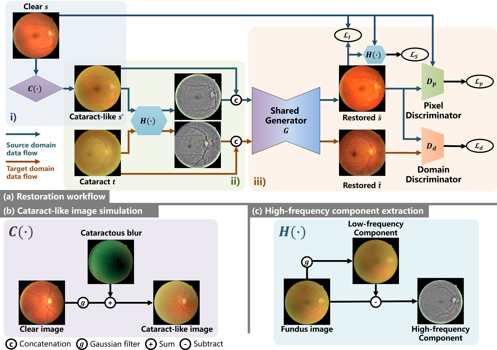
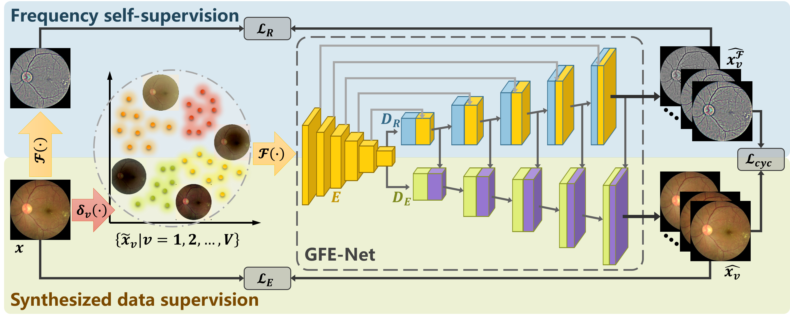

# **An Annotation-free Restoration Network for Cataractous Fundus Images**
There is little access to large datasets of cataract images paired with their corresponding clear ones. Therefore, it is unlikely to build a restoration model for cataract images through supervised learning.

Here, we propose an annotation-free restoration network for cataractous fundus images referring to [[arXir]](https://arxiv.org/abs/2203.07737).


Here is the citation information:

```
@article{li2022annotation,
  title={An annotation-free restoration network for cataractous fundus images},
  author={Li, Heng and Liu, Haofeng and Hu, Yan and Fu, Huazhu and Zhao, Yitian and Miao, Hanpei and Liu, Jiang},
  journal={IEEE Transactions on Medical Imaging},
  volume={41},
  number={7},
  pages={1699--1710},
  year={2022},
  publisher={IEEE}
}
```

# Structure-consistent Restoration Network for Cataract Fundus Image Enhancement

A method of structure-consistent restoration network for cataract fundus image enhancement is proposed referring to [[arXiv]](https://arxiv.org/abs/2206.04684). 


Here is the citation information:

```
@article{li2022annotation,
  title={An annotation-free restoration network for cataractous fundus images},
  author={Li, Heng and Liu, Haofeng and Hu, Yan and Fu, Huazhu and Zhao, Yitian and Miao, Hanpei and Liu, Jiang},
  journal={IEEE Transactions on Medical Imaging},
  volume={41},
  number={7},
  pages={1699--1710},
  year={2022},
  publisher={IEEE}
}
```


# A Generic Fundus Image Enhancement Network Boosted by Frequency Self-supervised Representation Learning

A generic fundus image enhancement network (GFE-Net) to solve any image degradation without supervised data, which is accepted by Medical Image Analysis in August, 2023. More information referring to [arXiv](https://arxiv.org/abs/2309.00885).



Here is the citation information:

```
@article{li2023generic,
  title = {A generic fundus image enhancement network boosted by frequency self-supervised representation learning},
  journal = {Medical Image Analysis},
  volume = {90},
  pages = {102945},
  year = {2023},
  issn = {1361-8415},
  doi = {https://doi.org/10.1016/j.media.2023.102945},
  url = {https://www.sciencedirect.com/science/article/pii/S1361841523002050},
  author = {Heng Li and Haofeng Liu and Huazhu Fu and Yanwu Xu and Hai Shu and Ke Niu and Yan Hu and Jiang Liu},
}
```


# Prerequisites

\- Win10

\- Python 3

\- CPU or NVIDIA GPU + CUDA CuDNN

# Environment (Using conda)

```
conda install numpy pyyaml mkl mkl-include setuptools cmake cffi typing opencv-python

conda install pytorch torchvision -c pytorch # add cuda90 if CUDA 9

conda install visdom dominate -c conda-forge # install visdom and dominate
```

# Simulation of images

## Cataract images (for ArcNet and SCRNet)

Use the script in ./utils/catacact_simulation.py

Before simulation, you can use ./data/run_pre_process.py to get the pre-processed image and mask.

## Low quality image (for GFE-Net)

Use the script in data/get_low_quality/run_pre_process.py, and modify the image_root and save_root to get the images and masks after preprocessing.

Then, use the script in data/get_low_quality/main_degradation.py and modify the image_root to the save_root, defined last step, to get the low_quality_image and low_quality_mask.

# Dataset preparation

To set up your own dataset constructed like images/cataract_dataset. Note that the number of source images should be bigger than the number of target images, or you can design you own data loader.

If you don't have any mask image, you can use util/get_mask.py to get the mask of target and source, and place them into the dataset. 

If you have simulated the low quality image following the previous steps, you can arrange them in the proper format to suit the dataloader.

For a cataract dataset, the architecture of the directory should be: (You can use different image format but you might need to modify the code.)

--cataract_dataset

​	--source

​		--AB.jpg

​	--source_mask

​		--AB.png

​	--target

​		--A.jpg

​	--target_mask

​		--A.png

# Visualization when training

python -m visdom.server

# To open this link in the browser

http://localhost:8097/

## Trained model's weight

**Note:** If you want to use ArcNet in your own dataset, please re-train a new model with your own data, because it is a method based on domain adaptation, which means it needs target data (without ground truth) in the training phase.

For the model of ArcNet 'An Annotation-free Restoration Network for Cataractous Fundus Images'', SCR-Net, 'Structure-consistent Restoration Network for Cataract Fundus Image Enhancement', and  GFE-Net, 'A Generic Fundus Image Enhancement Network Boosted by Frequency Self-supervised Representation Learning' please download the pretrained model and place the document based on the following table:

|         | Baidu Cloud                                                  | Google Cloud                                                 | Directory                                        |
| ------- | ------------------------------------------------------------ | ------------------------------------------------------------ | ------------------------------------------------ |
| ArcNet  | [ArcNet [3xg0]](https://pan.baidu.com/s/1hFt0bMpBb5V0Gj0ogYHGbA) | [ArcNet](https://drive.google.com/file/d/1VJ-_W7rRmy90AcgeAJtt_z7fgeBpC4Id/view?usp=share_link) | project_root/checkpoints/arcnet/latest_net_G.pth |
| SCR-Net | [SCR-Net in Baidu [o32j]](https://pan.baidu.com/s/1WKeyjMoXElkOJ4gkNO-71w) | [SCR-Net](https://drive.google.com/file/d/1Fwx1R3jHWdr9evW11Az8YYqBULPadZ1K/view?usp=sharing) | project_root/checkpoints/scrnet/latest_net_G.pth |
| GFE-Net | [GFE-Net [kgla]](https://pan.baidu.com/s/1e6zRCQ5CilFTzLX2h95acg) | [GFE-Net](https://drive.google.com/file/d/1cerN6u0aRKr1aiNl31pt7hdALSFJjt7i/view?usp=sharing) | project_root/checkpoints/gfenet/latest_net_G.pth |

# Command to run

Please note that root directory is the project root directory.

## Train

For ArcNet:

```
python train.py --dataroot ./images/cataract_dataset --name arcnet --model arcnet --netG unet_256 --input_nc 6 --direction AtoB --dataset_mode cataract_guide_padding --norm batch --batch_size 8 --gpu_ids 0
```

For SCR-Net:

```
python train.py --dataroot ./images/cataract_dataset --name scrnet --model scrnet --input_nc 3 --direction AtoB --dataset_mode cataract_with_mask --norm instance --batch_size 8 --gpu_ids 0 --lr_policy linear --n_epochs 150 --n_epochs_decay 50
```

For GFE-Net:

```
python train.py --dataroot ./images/cataract_dataset --name train_gfenet --model gfenet --direction AtoB --dataset_mode cataract_with_mask --norm instance --batch_size 8 --gpu_ids 2 --lr_policy linear --n_epochs 150 --n_epochs_decay 50
```

Released soon.

## Test & Visualization

For ArcNet:

```
python test.py --dataroot ./images/cataract_dataset --name arcnet --model arcnet --netG unet_256 --input_nc 6 --direction AtoB --dataset_mode cataract_guide_padding --norm batch --gpu_ids 0
```

For ScrNet:

```
python test.py --dataroot ./images/cataract_dataset --name scrnet --model scrnet --netG unet_combine_2layer --direction AtoB --dataset_mode cataract_with_mask --input_nc 3 --output_nc 3
```

For GFE-Net:

```
python test.py --dataroot ./images/cataract_dataset --name gfenet --model gfenet --dataset_mode cataract_with_mask --load_size 256 --crop_size 256
```

Released soon.

## Train and test for 512 x 512

Please modify the option of 'load_size' to 512 when using train.py

```
--load_size 512 --crop_size 256
```

In  test.py

```
--load_size 512 --crop_size 512
```

# Reference

[1] A. Mitra, S. Roy, S. Roy, and S. K. Setua, “Enhancement and restoration of non-uniform illuminated fundus image of retina obtained through thin layer of cataract,” Computer methods and programs in biomedicine, vol. 156, pp. 169–178, 2018.

[2] Cheng J ,  Li Z ,  Gu Z , et al. Structure-Preserving Guided Retinal Image Filtering and Its Application for Optic Disk Analysis[J]. IEEE TRANSACTIONS ON MEDICAL IMAGING MI, 2018.

[3] L. Cao, H. Li, and Y. Zhang, “Retinal image enhancement using lowpass filtering and α-rooting,” Signal Processing, vol. 170, p. 107445, 2020.

[4] Isola P ,  Zhu J Y ,  Zhou T , et al. Image-to-Image Translation with Conditional Adversarial Networks[C]// IEEE Conference on Computer Vision & Pattern Recognition. IEEE, 2016.

[5] Zhu J Y ,  Park T ,  Isola P , et al. Unpaired Image-to-Image Translation using Cycle-Consistent Adversarial Networks[J]. IEEE, 2017.

[6] Luo Y ,  K  Chen,  Liu L , et al. Dehaze of Cataractous Retinal Images Using an Unpaired Generative Adversarial Network[J]. IEEE Journal of Biomedical and Health Informatics, 2020, PP(99):1-1.

[7] Z. Shen, H. Fu, J. Shen, and L. Shao, “Modeling and enhancing lowquality retinal fundus images,” IEEE transactions on medical imaging, vol. 40, no. 3, pp. 996–1006, 2020.

[8] Li H ,  Liu H ,  Hu Y , et al. Restoration Of Cataract Fundus Images Via Unsupervised Domain Adaptation[C]// 2021 IEEE 18th International Symposium on Biomedical Imaging (ISBI). IEEE, 2021.

[9] Li H, Liu H, Hu Y, et al. An Annotation-free Restoration Network for Cataractous Fundus Images[J]. IEEE Transactions on Medical Imaging, 2022.

# Citation

```
@article{li2022annotation,
  title={An annotation-free restoration network for cataractous fundus images},
  author={Li, Heng and Liu, Haofeng and Hu, Yan and Fu, Huazhu and Zhao, Yitian and Miao, Hanpei and Liu, Jiang},
  journal={IEEE Transactions on Medical Imaging},
  volume={41},
  number={7},
  pages={1699--1710},
  year={2022},
  publisher={IEEE}
}
@inproceedings{li2022structure,
  title={Structure-consistent restoration network for cataract fundus image enhancement},
  author={Li, Heng and Liu, Haofeng and Fu, Huazhu and Shu, Hai and Zhao, Yitian and Luo, Xiaoling and Hu, Yan and Liu, Jiang},
  booktitle={International Conference on Medical Image Computing and Computer-Assisted Intervention},
  pages={487--496},
  year={2022},
  organization={Springer}
}
@article{li2023generic,
  title={A generic fundus image enhancement network boosted by frequency self-supervised representation learning},
  author={Li, Heng and Liu, Haofeng and Fu, Huazhu and Xu, Yanwu and Shu, Hui and Niu, Ke and Hu, Yan and Liu, Jiang},
  journal={arXiv preprint arXiv:2309.00885},
  year={2023},
}
```
